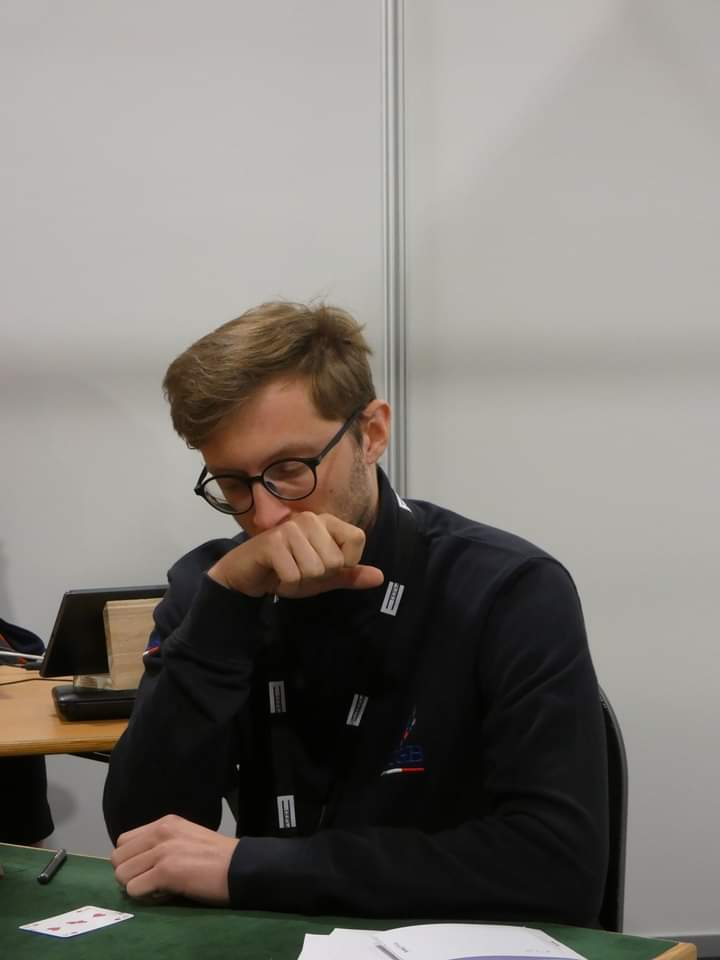

Hello everyone, I'm Alvaro. I'm a recent (2022) graduate in Philosophical Sciences of Università
degli Studi di Padova with a great passion for <abbrtitle="Information Technology">IT</abbr>
and technology in general.

 <figure style="text-align:center;">  <figcaption style="font-size:80%;">Me trying to come up with a backwash squeeze</figcaption></figure>

In my free time I enjoy playing and teaching Bridge (I have been a member of Italy's U26 team since 2014), programming and finding out about new and exciting board games. I'm quite a bookworm (I particularly enjoy
essays and contemporary American authors) and a recently discovered avid listener of old vinyl records (thanks to my dad and uncle's collection). I really enjoy running and cooking too.

While I had a passion for medicine, physics and math since I was little, when it came to choose a degree,
I went with Philosophy. While attending university, my philosophical interests evolved a quite a lot. Starting
with a passion for theoretical philosophy, I gradually developed a strong
interest in analytic
philosophy, mainly regarding philosophy of science, of medicine and of
language. I engaged (and still engage) environmental and AI ethics issues with pleasure too.

Besides, I worked extensively
and for quite a while on causality. I focused especially on 
 <abbr 
 title="Structural Causal Model">SCM</abbr><small>s</small>,
  with particular attention devoted to [Judea Pearl](https//:en.wikipedia.org/wiki/Judea_Pearl)'s framework
  and thought,
  and tried to apply them to the development of a non-reductive theory
  of causality (which is quite a different beast compared to
  _old school_ theories). This effort culminated in the writing of my (soon to be translated in english)
  [Master's Thesis](ModelliCausali.pdf). If you wanna learn more about the
  incredible world of causality, I wrote a post about it: [go check it out](/posts/causality)!

This personal page was born with the aim of collecting some of the things I did during the years and to document the new exciting things I'm going to experience in the years to come. Come and join me in this journey and hop in the [Home](/) or [Archive](/archives) sections!
