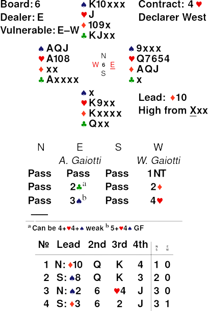
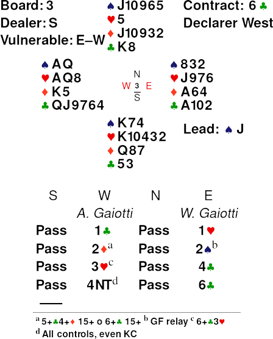
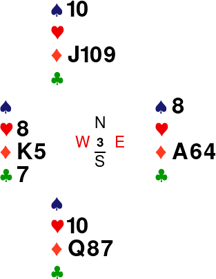
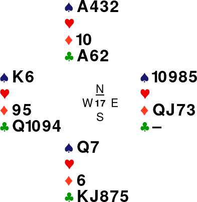
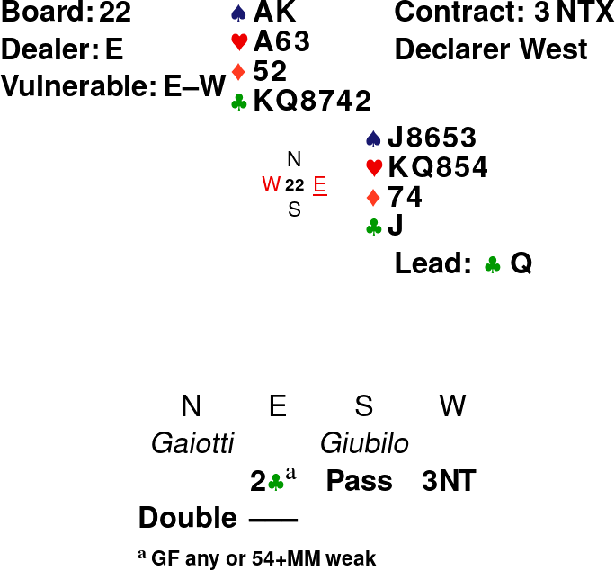
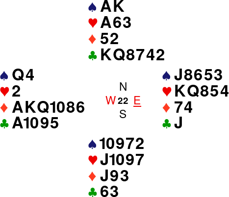

In this post I'll report some hands I played during this year.

## Hand 1

Let's start _in medias res_:


<figure style="text-align:center;">

</figure>


The bidding is not particularly exciting, just a standard Smolen sequence over 1NT.
The play is reported under the figure. The situation looks bleak: we already lost 3 tricks and we still have to
tackle trumps. To bring trumps in with zero losers, we must hope for an original 4-1 break with stiff J in North.
We'll need to finesse twice, starting with the  &#9829;Q,
and then finesse the  &#9829;9. But even if trumps come
in, we'll be one trick short since we won't be able to ruff a Spade. So we'll need some other way to find the fateful
10th trick.A  squeeze looks like a great idea, since, as we need South to
have four Hearts for our plan to succeed (bringing in trumps), North will be a favorite to hold a Club guard on top of
the sure Spade guard. But, still,
communications are a bit messy and a simple squeeze can't be set up, so we'll need to go with a trump squeeze. So, while in
dummy, we play the   &#9829;Q. Imagine that South doesn't
cover (immaterial if he does) and the J drops. Now we know we can make the contract if North has at least 4 Clubs: we
cash the   &diams;A discarding a Club, then we play a
club to the A and ruff a Club. Now we play Heart to the 10 North discarding a Spade.

Here the diagram of the situation:

<figure style="text-align:center;">

</figure>


Now we cash the  &hearts;A and North is squeezed: if he parts with a Spade, we cash the   &spades;A and ruff
a Club to enjoy the established Spade; if he discards a Club, we ruff a Club, dropping both the King and the Queen
and get back in hand with the  &spades;A and enjoy the established Club. Nice!

## Hand 2


<figure style="text-align:center;">

</figure>


Not a really nice slam, but after the lead I was relieved: now it was a 75%
slam. South played small and I took with the Q. Then played the 
&clubs;Q, which was
covered.
Now I cannot go down no matter what I played, so I played a Heart (can you see why is
it OK to risk a 6-0 Heart break? Hint: I saw it because I was looking for a squeeze)
to the Q, which held, then cashed two Clubs ending in dummy (splitting 2-2).
North discarded a Diamond and South a Heart, which gave me quite a clear
picture about the position as it looked like South had 5 Hearts and North 5
Diamonds (he has two Clubs and one Heart, and he didn't discard a Spade so he
has not six of them). And, indeed, when I played the  &hearts;J, it was covered and North
discarded a Spade. When I cashed another Club, North parted with a Spade, I
discarded a Heart from dummy and South did the same. I tried to cash another Club, hoping for a wrong discard and, indeed, North discarded a Diamond and South parted with the wrong suit, Spades, isolating the Spade menace! Now it was a matter of cashing the Ace of Spades dropping the King, which brings us in the following position:


<figure style="text-align:center;">

</figure>


Now, when I cash the  &clubs;7, a classic double squeeze operates.

## Hand 3


<figure style="text-align:center;">

</figure>

This one was a curious hand to play, as I found no sensible way to play it. My
line was quite straightforward: I took the Spade lead with the 
&spades;A and played a Heart to the Q, which was captured. On a trump return I had in mind to play a small Diamond to the 9 (which was probably best to start with, instead of trumps) as I didn't like the idea to open up Clubs, but a Spade came back, so I discarded a Club from hand and took with the 
&spades;K in dummy. I was quite content as now I could play a Diamond to the King without opening up the Club suit, which might have endplay potential if the situation got ripe. The 
&diams;9 was covered by the J, I played the King, which was captured, then South played a Spade. I ruffed that in hand, ruffed a Diamond and played another spade, on which North discarded a Diamond. Here I overlooked the situation, as, since North covered the 9 with the J and did not play a Diamond back when he took the 
&hearts;A, he could not have
QJxxx or Jxxx in Diamond, so he must have had Jxx. Now I should have had a
complete count as South didn't lead a Club, so he's definitely not singleton in
Clubs (or he has a Q singleton, in which case I can make even if I play Hearts
the wrong way), and this brings us to his probable starting distribution:
5-1-5-2, meaning that North must be 3-3-3-4. Now I had a lock by simply playing
the Heart King and ruffing a Diamond: if North overruffs he's endplayed, if he
discards a Club, I can play Hearts and endplay him no matter what. Instead, I
was sure (don't ask me why!) I had to ruff both Diamonds to get to 10 tricks,
basically playing a dummy reversal.  So I played a Diamond, ruffed and
overruffed; and now North still had a small Heart to endplay me, forcing me to
open up the Clubs. Result: one off and quite a bit of steam.

## Hand 4

<figure style="text-align:center;">

</figure>


Finally some defense. Here I was seated in East and you can see the bidding and lead in the diagram. 
&spades;K ducked and
 &spades;Q continuation, captured, dummy discarding a Club. Declarer now wrongly tried the Diamond
finesse and now I had to lead. I knew declarer must have had the Club Ace, as
the play is otherwise nonsensical: we could now get 2 Spades, 2 Clubs and
1 Diamond, so declarer has, almost for sure, the hand in the diagram. The
situation looked quite bleak to me and I thought the best hope was to play
a Heart, hoping for partner to duck and for declarer to repeat the finesse. Now
partner could take, cash the Spade and play another Heart, leaving declare
unable to come up with the 9th trick, as I couldn't get squeeze by that time. So I played a small Heart, and my partner didn't duck has I hoped. He took the 
&hearts;K, cashed the 
&spades;J and played a Spade. Now, on the run of Hearts i got squeezed.

My partner didn't duck as I hoped but that would have been immaterial as I had miscounted and forgot that, even if he ducked, the 
&hearts;Q was sitting in dummy, reachable thanks to Diamonds without breaking up communications, ready to be cashed and squeeze me in Clubs and Diamonds.

At the table, I felt there was some way to beat the contract as the Diamond
play was clearly wrong, giving up an extra trick to defenders without any clear
benefits. And, indeed, the right way came to my mind just before I picked up the
cards for the next board (as usual, so you can curse while you badly play the
next hand, too): I could count 4 tricks for the defence (2
&spades;,1
&diams; and 1
&hearts;), so it was simply a matter of establishing an extra trick, and not about breaking up declarer's communications! And, should have been clear to me, the only suit in which this trick can be established is Clubs (as I knew declare would have played on Clubs with Axx
&clubs;). The only thing I would have needed was to play a small Club, giving up a trick and helping to establish dummy's Club, of course, but there weren't enough entries to do that before defense was able to get 5 tricks: if declarer unblocked the 
&clubs;A, whenever my
partner took his  &hearts;K, he could cash his master Spade and play a Club for me to cash the
King. If declarer tried to play Heart to the J to open up his communications
and simultaneously remove West entry to the Spade, it would have been
sufficient for West to duck, removing a vital entry for dummy's Clubs. The idea to
give up a trick to establish one trick later was quite counter-intuitive, wasn't it?

## Hand 5

<figure style="text-align:center;">

</figure>


This is a hand I played during the 7th World Youth Transnational Bridge Championships.

I'm quite proud of this hand to be sincere. Lead was 
&diams;2, nominally 4th best.
Clearly, the position is fairly simple: we have 8 tricks and we need the 9th, but we can't afford to
lose any extra tricks outside diamonds as it would be the 5th trick for the defence.
The best approach is, before starting Clubs, to draw 4 round of Hearts, following
the old adage "When you have 8 tricks, start by cashing them.". Opponents
followed three rounds. On the 4th round Est, knowing I had 4 Spades, discarded
the  &spades;J,
a strange discard that probably comes from JT9xx
&spades;, but this was suspicious as, with that holding, he might as well tried his luck in Spades instead of Diamonds. I discarded a Club from dummy and West discarded the 
&diams;4.
Now the situations is quite weird, as West did not even suffer to discard the
Diamond, and I think that with an original holding of 5 Diamonds he might as
well have thought at least a couple of seconds (I played the hand extremely
fast on purpose to not let the opponents think in the early tricks). So now I
decided to go with my read and play East for a 5-3-5-0, imagining a layout like this:


<figure style="text-align:center;">

</figure>


Playing a Diamond and hoping for the  &diams;K in West, which would mean that the defence
cannot both set up a Spade and manage to run Diamonds (as Spades need to be played
by East and for him to get in on the first round he must block the suit), and if that happens, I can throw in West with the Queen of Spades, or, if
they unblock the suit and cash it (what happened at the table), the last Diamond squeezes West. If they cash only three Diamonds and then play Spades, I can again endplay West by playing the Q of Spade. A really beautiful hand!

## Hand 6


<figure style="text-align:center;">

</figure>


This another hand I played during the 7th World Youth Transnational Bridge Championships. This time, as you can see, I doubled a contract and I had to manage to beat it.

After this telling auction, you must defend 3NT Doubled. I led the  &clubs;Q, West
following, partner playing the  &clubs;6 (UDCA attitude I
thought, turns out, in this situation, is quite a mess what signal should
partner provide and that spawned a quite heated discussion). Now I
basically had quite a precise idea of declarer hand: he has not looked for a
fit in a major, so he must be quite short in Hearts and Spades. Besides, he has
not that many points, so his bid must be based on a strong Diamond suit,
probably at least 6 winners. Now I already had the correct idea to beat the
contract but, I must admit it, I had a moment of fear and insecurity: the logic
of the defence was crystal clear, declarer had 7 at least 7 tricks in the bag,
and if he had 7 Diamonds, I had to play him for 2-1-7-3 or 2-1-6-4. But, I was unsure
about the meaning of my partner's carding, and I hoped, in a silly way, for the
 &clubs;10
in his hand, so I played a small club. Obviously, my partner produced the much dreaded 3.
Now I had already gave the contract to declarer, as I saw that, if he cashed everything, I would have been
endplayed. But, luckily, declarer, unaware of the position, tried to sneak past my Ace of Heart to steal the ninth trick. I gave it a bit of thought, but I knew the only way to beat the contract now is to play declarer for 1-2-6-4, which is what I did: I went up with the  &hearts;A, cashed AK &spades; and, finally, endplayed West with a Diamond.
Here the complete diagram:

<figure style="text-align:center;">

</figure>


Spectacular defence, indeed, but, had I trusted my insight and reasoning at the first opportunity, it would have been even more spectacular (and less risky!).

That's all for today. Thanks for reading and following me. I'll be back with more Bridge contents soon!
